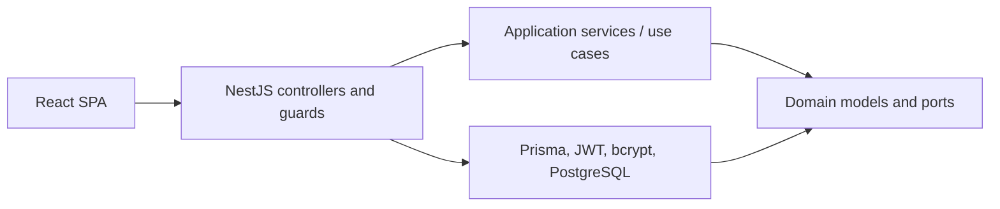
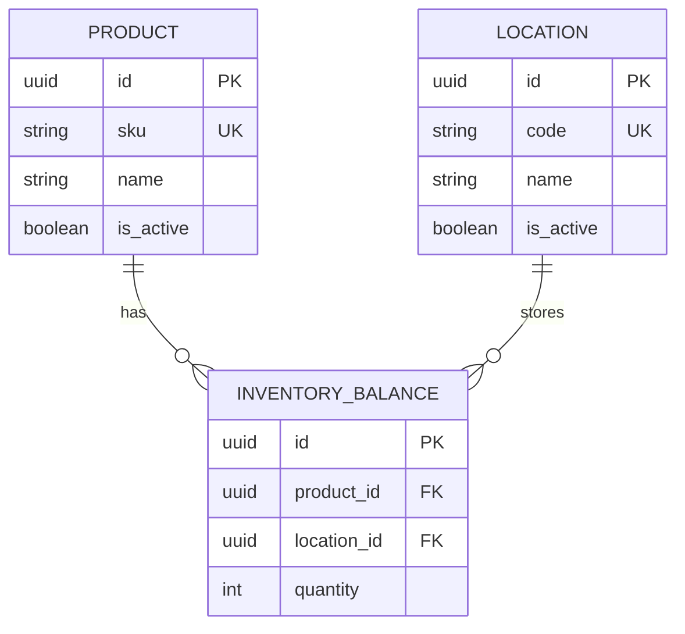

# Stockline Architecture

Stockline applies Clean Architecture through dependency direction, not folder names.

## Boundaries

- **Domain:** authentication and inventory concepts plus repository/security ports. It imports neither NestJS nor Prisma.
- **Application:** use cases for sessions, users, products, locations, and stock. It coordinates ports and owns business rules.
- **Infrastructure:** Prisma repositories, PostgreSQL adapter, JWT signing, refresh-token hashing, and password hashing.
- **Presentation:** HTTP DTO validation, controllers, guards, role metadata, error mapping, and the React client.

## Inventory model

`InventoryBalance` is explicit because quantity belongs to the relationship. The database enforces a unique product/location pair and a non-negative quantity.

## Security decisions

- Access tokens are signed with HS256 and expire after approximately one hour.
- Refresh tokens are opaque random values. Only their SHA-256 hashes are persisted.
- Refresh rotates the session transactionally. Logout revokes every active session for the user.
- Inactive users receive `401`; authenticated users with expired subscriptions receive `403`.
- The first administrator can be bootstrapped without authentication. Later administrators require an authenticated administrator.
- There is no role-change endpoint. An administrator cannot deactivate themself or the final active administrator.

